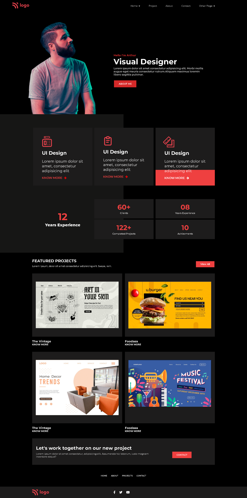

# Product Design Landing Page &nbsp;  &nbsp; 

## Skills acquired 👨‍💻
- How to design the cards using flexbox properties.
- Learned how to use the transition property.

## Time taken to complete the project ⏲️

12 hrs

## Screenshot &nbsp; 

 
 

 
 
